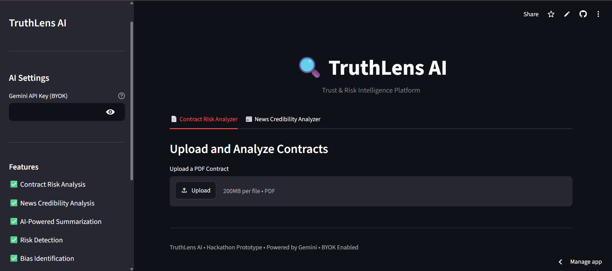
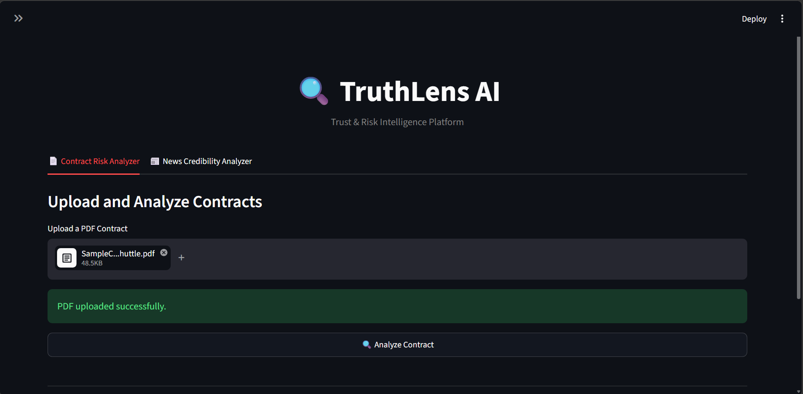
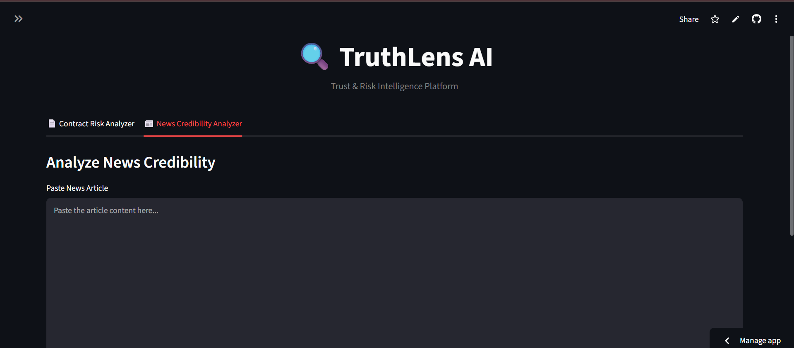

# 🔍 TruthLens AI

## 🌐 Live Demo

https://truthlens-aigit-s14a.streamlit.app/

---

## Overview

TruthLens AI is an AI-powered Trust and Risk Intelligence Platform designed to help users make informed decisions by analyzing contracts and evaluating the credibility of news content.

The platform leverages Google's Gemini AI model to provide clear summaries, identify risks, detect bias, and generate actionable insights from complex documents and articles.

TruthLens AI supports **Bring Your Own Key (BYOK)**, allowing users to securely connect their own Gemini API credentials without storing sensitive keys on the platform.

---

## Problem Statement

In today's digital world, users are constantly exposed to:

* Complex legal contracts that are difficult to understand.
* Misleading or biased news articles.
* Information overload that makes verification challenging.

Many individuals lack the expertise or time required to carefully review such content before making important decisions.

---

## Solution

TruthLens AI simplifies information analysis by using Generative AI to:

* Analyze contracts and identify potential risks.
* Summarize lengthy legal documents.
* Evaluate the credibility of news articles.
* Detect possible bias and misinformation.
* Provide understandable recommendations.

---

## Features

### 📄 Contract Risk Analyzer

* Upload PDF contracts.
* Generate concise summaries.
* Identify risky clauses.
* Highlight user obligations.
* Provide recommendations and risk insights.

### 📰 News Credibility Analyzer

* Analyze news articles and reports.
* Extract major claims.
* Detect potential bias.
* Evaluate credibility.
* Generate AI-powered verdicts.

### 🔑 Bring Your Own Key (BYOK)

* Secure Gemini API integration.
* User-provided API keys.
* No permanent credential storage.
* User-controlled AI usage and quota.

---

## Tech Stack

### Frontend

* Streamlit

### Backend

* Python

### AI Model

* Google Gemini 2.5 Flash

### Libraries

* google-generativeai
* pypdf
* plotly

### Package Management

* uv

---

## Project Structure

```text
truthlens-ai/
│
├── app.py
│
├── modules/
│   ├── contract_analyzer.py
│   └── news_analyzer.py
│
├── utils/
│   ├── gemini_client.py
│   └── pdf_loader.py
│
├── pyproject.toml
├── uv.lock
├── README.md
├── USER_MANUAL.md
├── SYSTEM_ARCHITECTURE.md
├── PROJECT_REPORT.md
└── assets/
```

## Installation

### Clone Repository

```bash
git clone <repository-url>
cd truthlens-ai
```

### Install Dependencies

```bash
uv sync
```

---

## Running the Application

```bash
uv run streamlit run app.py
```

---

## Usage

### Step 1

Launch the application.

### Step 2

Enter your Gemini API Key in the sidebar.

### Step 3

Choose one of the available modules:

* Contract Risk Analyzer
* News Credibility Analyzer

### Step 4

Upload a contract PDF or paste a news article.

### Step 5

Click Analyze and review the generated report.

---

## Application UI

### Home Page



### Contract Analysis



### News Analysis



---

## Future Enhancements

* Real-time web fact-checking
* Multi-language support
* Browser extension integration
* Social media content verification
* Advanced trust scoring dashboard
* Multiple AI model providers

---

## Team Members

* Simran Sharma
* Kishor Chary

---

## License

This project was developed as part of a hackathon and is intended for educational and demonstration purposes.
